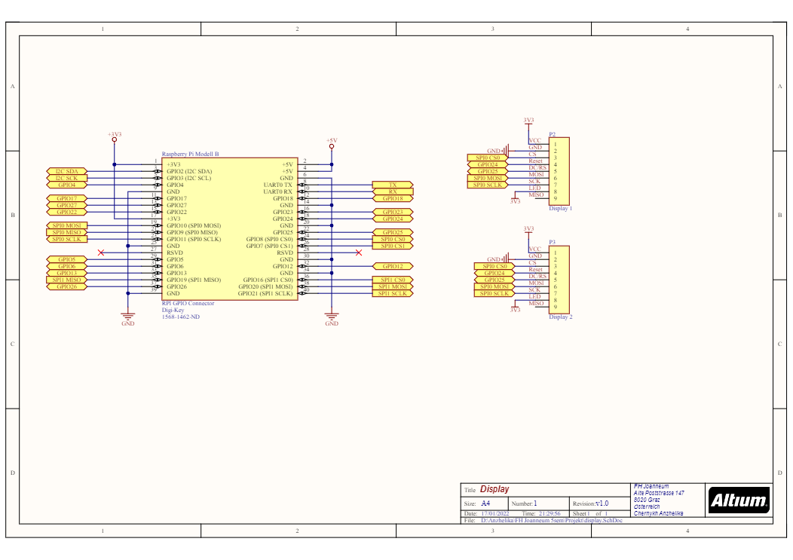

### Task
With the displays the points of every team as well as the winner is displayed. In addition this module provides some sound-effects using a speaker.

## Construction

### Functionality

The display are controlled by the Raspberry-pi. For this game two displays are used. One for every Team. Both displays are connected to the raspberry pi via Y-Cables. For the usage of the sound-card, this card must be connected directly to the Raspberry-pi with 3.5 mm jack plugs. Every Sound-effect used in this game were taken from this website (linl einfügen). For the mounting of the displays

For informations about software characteristics and controlling look here.

## Technical characteristics

### Circuit

## Test scenarios

This test was accomplished with two 2.2 TFT SPI 240x320 Displays and a Raspberry-Pi 3B.

### Setup 

#### Configurations

raspi-config -> SPI enable

install following libaries: 

- sudo pip3 install Adafruit-Blinka

- sudo pip3 install adafruit-circuitpython-rgb-display

- sudo apt-get install python3-pil

sudo reboot

#### Pinouts

Display-> Pi

CLK -> SLCK

MOSI -> MOSI

CS -> CE0

D/C -> GPIO 25

RESET -> GPIO 24

Vin -> 3.3V

GND -> GND

LED -> 3.3V

## Components

For a list of all used components see the [Components](Components.md) section.

## Further informations

For informations about software characteristics and controlling look here.

