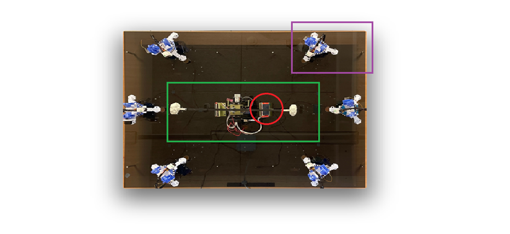

The CrazyComet playing field is build out of three major parts:

Display

Tower

Turrets

In this section of the documentation it is explained how each of those elements is constructed.  

Each module is controlled by its own Raspberry Pi (with a single Raspberry Pi for every single turret).  The Raspberry Pis are powered by a single 5V power supply unit. For Motorschield separate 12 V power supply was used.

