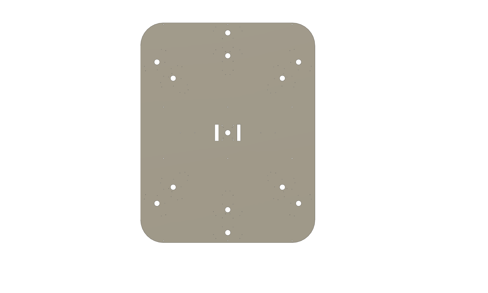

## Base Plate

All elements of the game crazy comet are attached to the base plate. Each turret are placed within a circle, so every player has the same chance of hitting the target. 

All connection cables are aligned on the bottom of the base plate. Each turret has at it's position a provided hole for the cables. 

For the ground plane to stand probably three M6 threaded bore holes are provided every 450mm.

### CAD Model of the base plate 

## Components

For a list of all used components see the [Components](Components.md) section.

## Further information

The 3D-Models is done with Fusion360.
