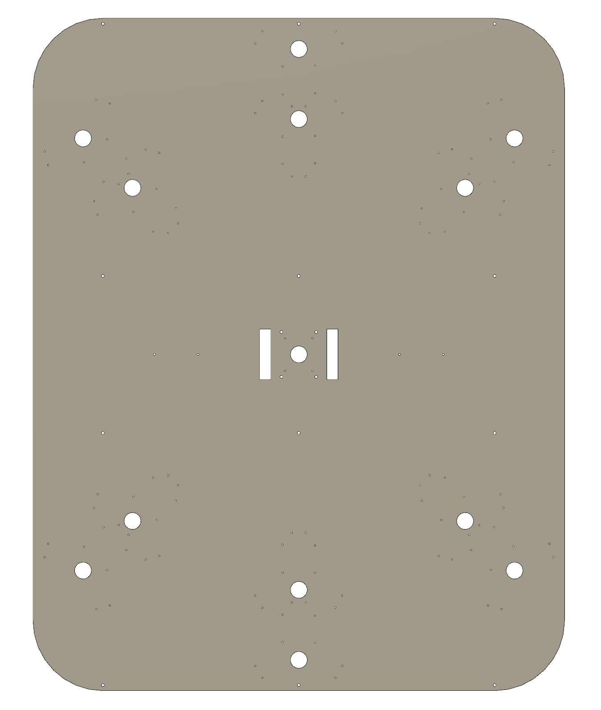

The CrazyComet playing field is build out of three major parts:

- [Display](./display.md)
- [Tower](./tower.md)
- [Turrets](./turrets.md)

In this section of the documentation it is explained how each of those elements is constructed.

Each module is controlled by its own Raspberry Pi (with a single Raspberry Pi for every single turret). The Raspberry Pi's are powered by a single 5V power supply unit. For the Motor shield a separate 12 V power supply was used.

All elements of the game CrazyComet are attached to the base plate. The turrets are placed within a circle, so every player has the same chance of hitting the target.

All connection cables are aligned on the bottom of the base plate. A hole to route the tables is provided for every turret

For the ground plane to stand properly three M6 threaded bore holes are provided every 450mm.

<figure markdown>
  { width="400" }
  <figcaption>3D-Model of the base plate</figcaption>
</figure>
