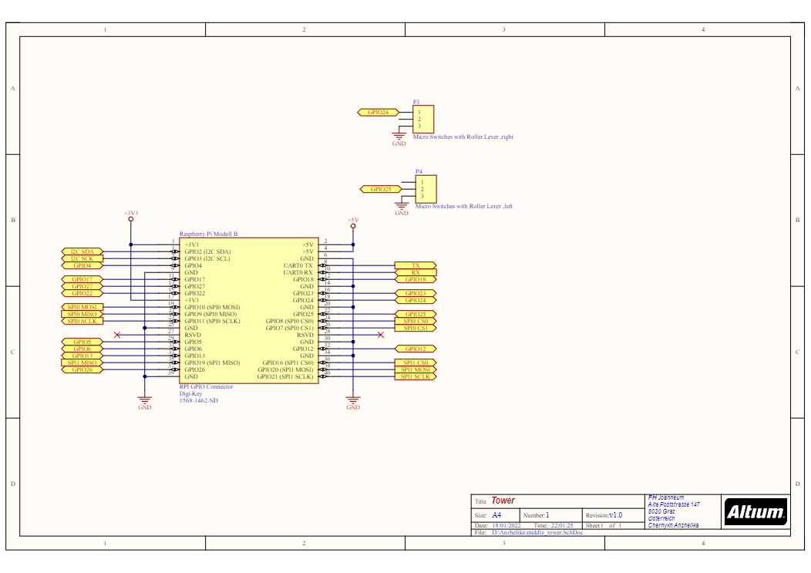
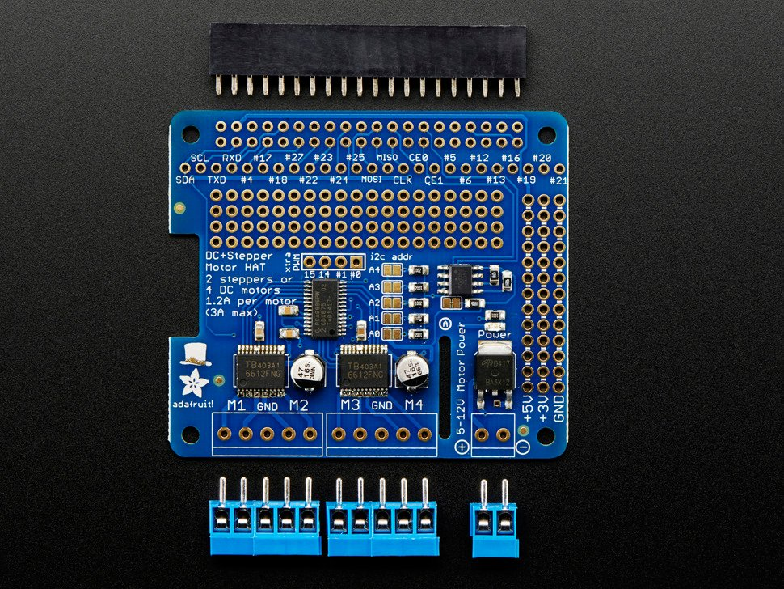

### Task
The tower is the central element of the playing field. It is used to move the comets around the playing field so every player has a chance to hit them.

## Construction

### Functionality

The tower consists of a base and an arm with a comet at each end. The arm can be rotated horizontally and tilted vertically. Both motions are created with a stepper motor. The stepper motors are controlled with the Raspberry Pi using a Adafruit Motor Shield.

### Adapted 3D-Model of middle Tower

## Technical characteristics

### Circuit (connection to Raspberry-Pi)

For the connection between motors, motorshield to Raspberry-Pi see [here](https://learn.adafruit.com/adafruit-dc-and-stepper-motor-hat-for-raspberry-pi/stacking-hats)

### Motorshield

### Important motion ratings

blabla

## Components

For a list of all used components see the [Components](Components.md) section.

## Further informations

For informations about controlling the turrets via controller and software solutions please look here

