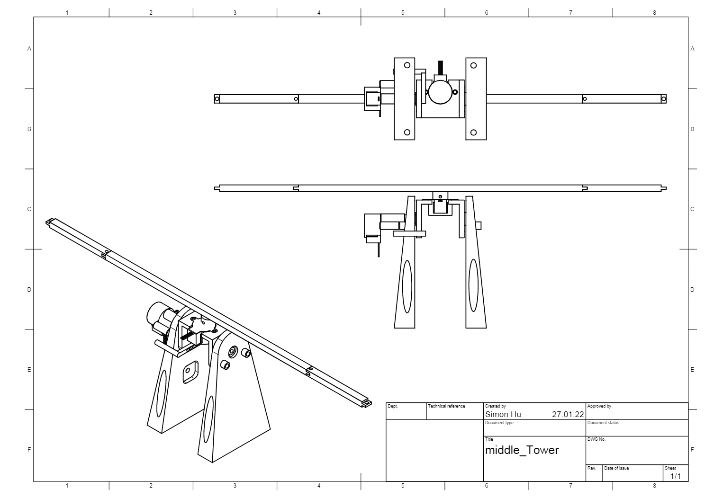

# Tower

The tower is the central element of the playing field. It is used to move the comets around the playing field so every player has a chance to hit them.

## Functionality

The tower consists of a base and an arm with a comet at each end. The arm can be rotated horizontally and tilted vertically. Both motions are created with a stepper motor. The stepper motors are controlled with the Raspberry Pi using a Adafruit Motor Shield. In order to avoid too far tilting to the right and to the left, 2 end stoppers and physical limitation are built in. 

## Technical characteristics

| Mechanical Device | Action |  State |
| --------------- | --------------- | --------------- |
| Side stepper motor | Tilting the tower |  +-16° right/left max |
| Top stepper motor | Arm rotation | Circular movement |

### Adapted 3D-Model of middle Tower

### Circuit (connection to Raspberry Pi)

For the connection between motors, motor shield to Raspberry Pi see [here](https://learn.adafruit.com/adafruit-dc-and-stepper-motor-hat-for-raspberry-pi/stacking-hats)

## Components

For a list of all used components see the [components](components.md) section.

## Further information

All 3D-Models were done with Fusion360.
For information about controlling the turrets via controller and software solutions please look here

