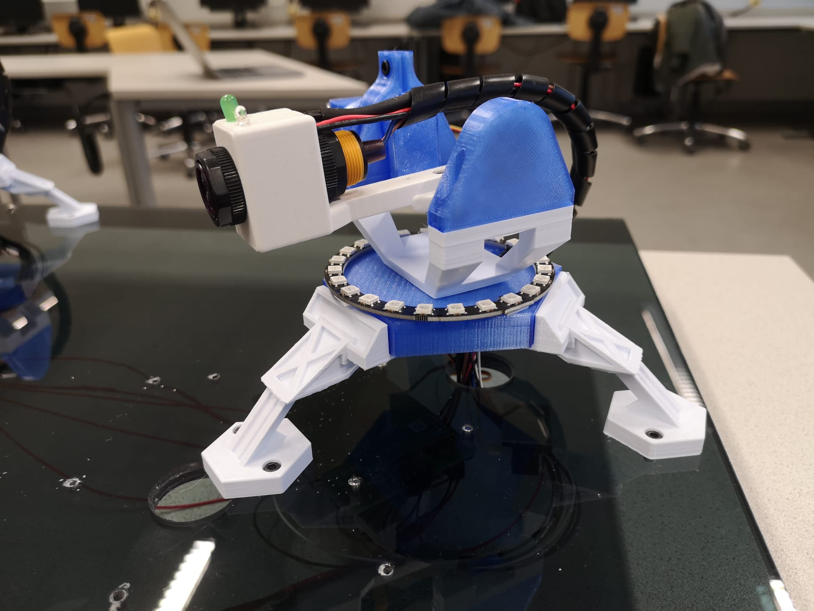
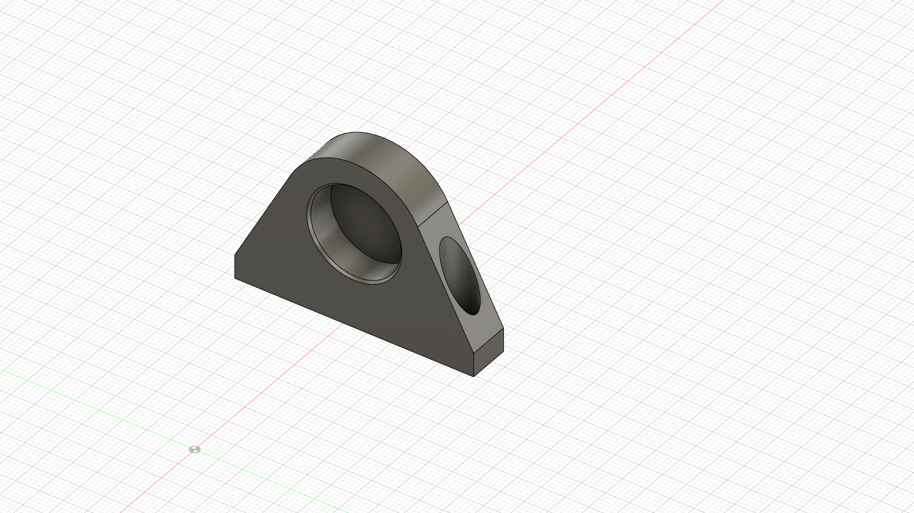
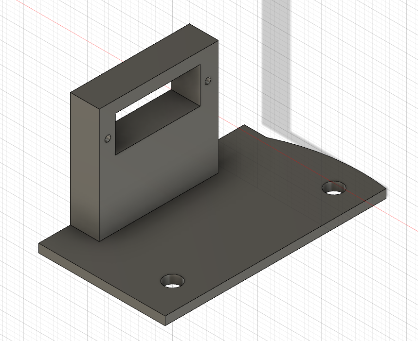
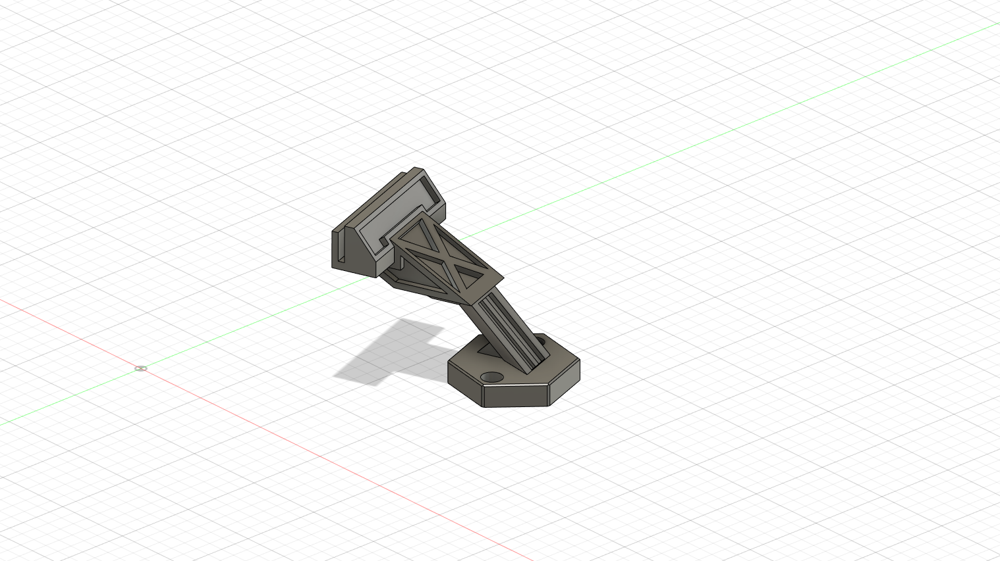
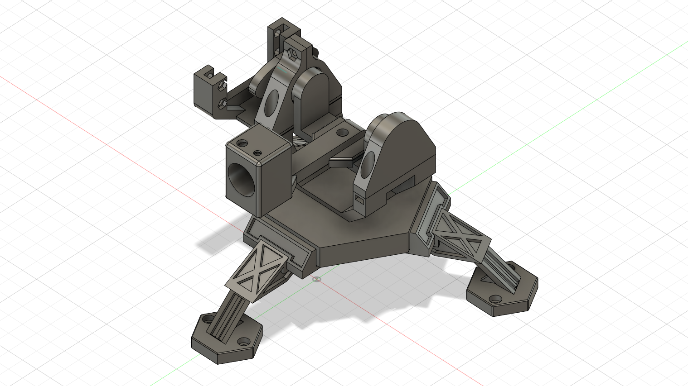
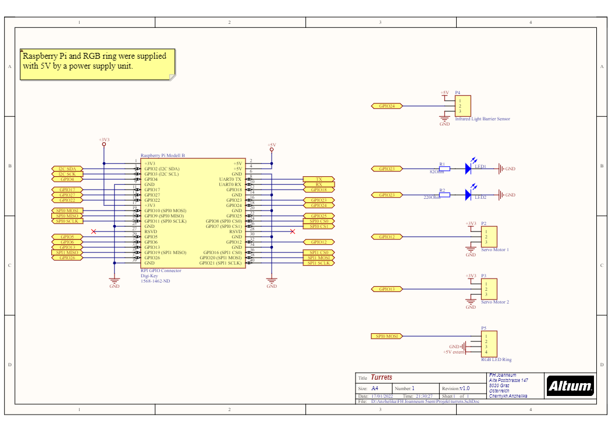

# Turrets

The turrets are controlled by the player. They are used to "shoot" the comets. In the current setup six turrets are used.

{ align=left width="355" }
{ align=right width="295" }
{ align=right width="295" }

## Construction

### Functionality

The model used for implementing the turrets was found on Thingiverse[^1]. We chose this model because the design went very well with our initial game idea and the fundamental movements (Horizontal and vertical rotation of the aiming part) were given. As said, the main technical functionality of this Prototype is to rotate horizontal and vertical in order ot give the player a good aiming experience. One is placed below the base of the turret. The other is placed on the right side of the top element. In order to detect if the player hit the comet a IR-Sensor is used. The model which is used returns a digital signal. The sensitivity can be tuned with a screw on the back of the sensor.Horizontal rotation of the aiming part would be indicated with the help of an RGB NEOPIXEL LED ring.

### Adapted 3D-Models of turrets

{ align=left width="210" }
{ align=left width="210" }
{ align=left width="210" }
{ align=left width="210" }
{ align=left width="210" }
{ align=left width="210" }
{ align=left width="210" }
{ align=left width="210" }
{ align=left width="210" }

### Adaptations

This model was not configured for our servo motors. Therefore, every part of the model connected to the motor needed to be changed. In addition the Blaster Model was created.

- Base: New configuration of the middle part. Adapted to fit our servo motor.
- Base_mount: Creating a little motor winding to fit in the base mount.
- Servo_bracket: Adapting the servo bracket to fit our servo motor
- Turret_legs: Added holes for mounting the Turret to the Base plate
- Blaster: New Model which held the Laser sensor, In addition two led's are used to display if the player shot (white) and if he hit (green). Both led's are positioned at the tip of the barrel of the turret.

## Technical characteristics

| Mechanical Device  | Action                   | Description                     | State                                                                                                 |
| ------------------ | ------------------------ | ------------------------------- | ----------------------------------------------------------------------------------------------------- |
| Bottom servo motor | Horizontal Turret motion | Joystick full right / full left | +-30° right/left max                                                                                  |
| Top servo motor    | Vertical Turret motion   | Joystick full up / full down    | +20° top max / -40° bottom max                                                                        |
| Indicators         | Shooting                 | RED / GREEN LED                 | Blinks every shot / Blinks when hit detected                                                          |
| Indicators         | Shooting                 | RGB Led Ring                    | blue at the game start, green if all players ready, show movement of the horizontal servo during play |
| Blaster            | Shooting                 | IR barrier switch               | Adjustable detection distance from 3 to 80 cm                                                         |

### Circuit (connection ot Raspberry Pi)

## Components

For a list of all used components see the [components](components.md) section.

## Further information's

All 3D-Models were done with Fusion360 and can be found on GitHub.
For more information's about controlling the turrets via controller and software solutions please look [here](https://4d-game.github.io/Controller/code-references/hardware/servo/).

[^1]: **Mini Turret** from **Cosantoir**, source: [www.thingiverse.com/thing:3181636](https://www.thingiverse.com/thing:3181636)