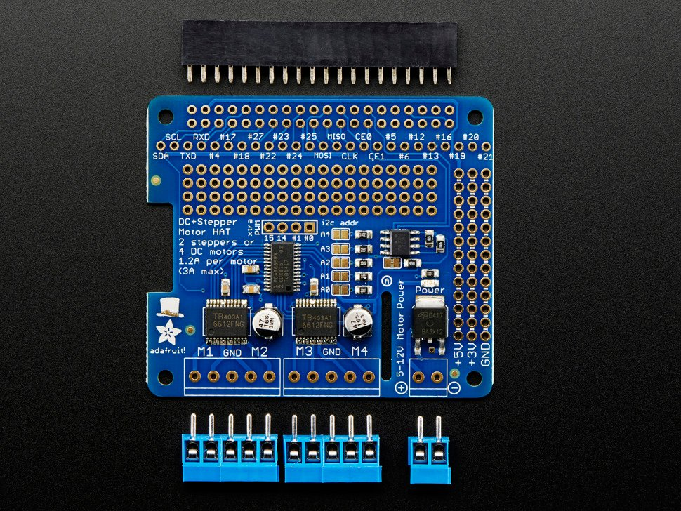

# **Motor Control**

## **Control with power supply**

1. Ansteuern bei verschiedener Spannung, bis zu einer max Spannung von 9V und einer Stromaufnahme von 350mA
2. höhere Spannung zu laut und wackelig

## **Control with adafruit motor shield on raspberry pi**+

