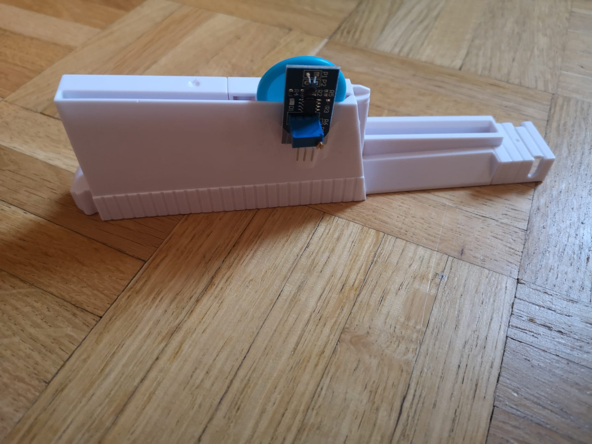
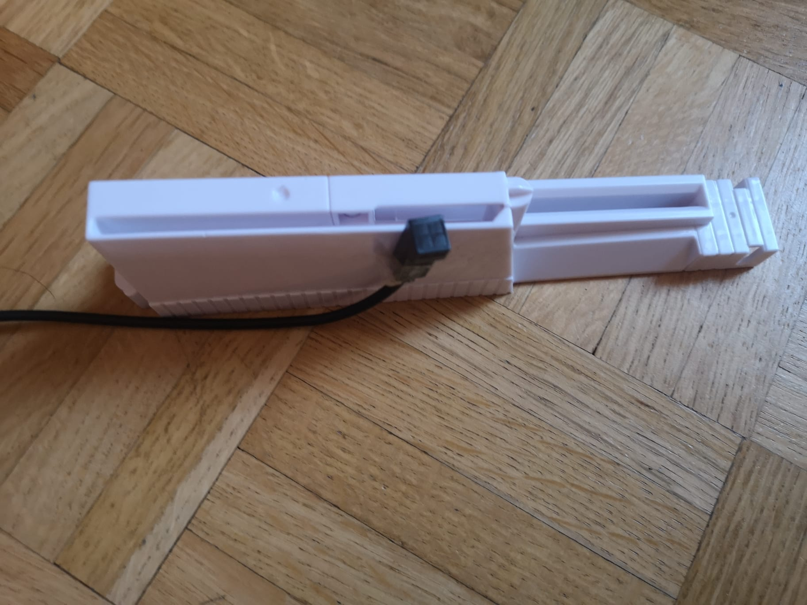
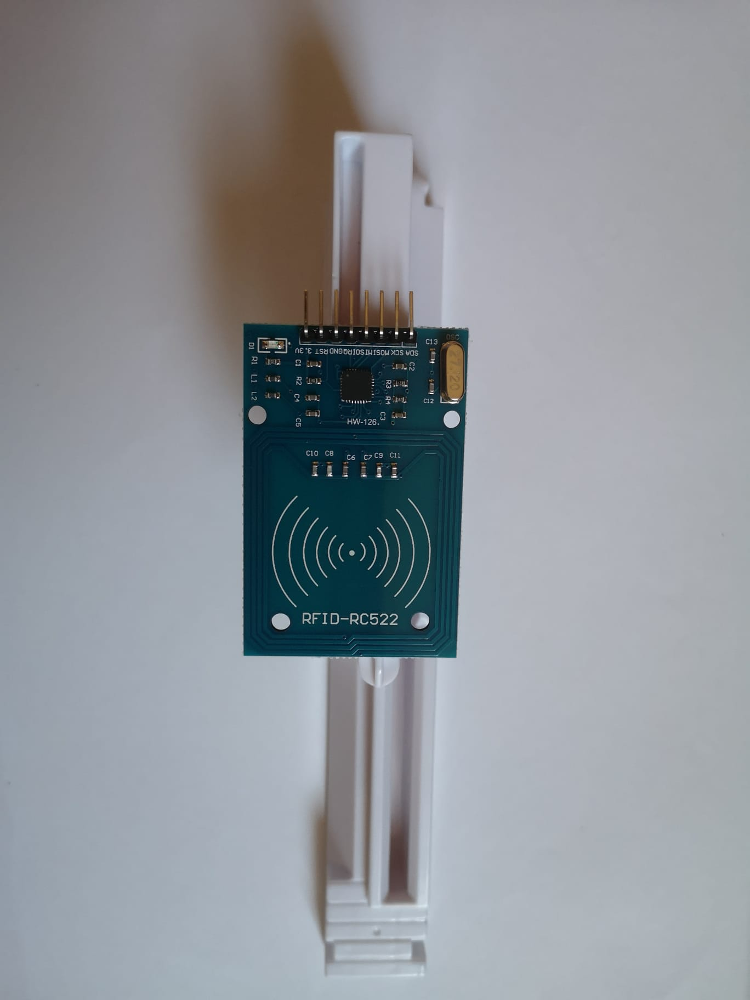
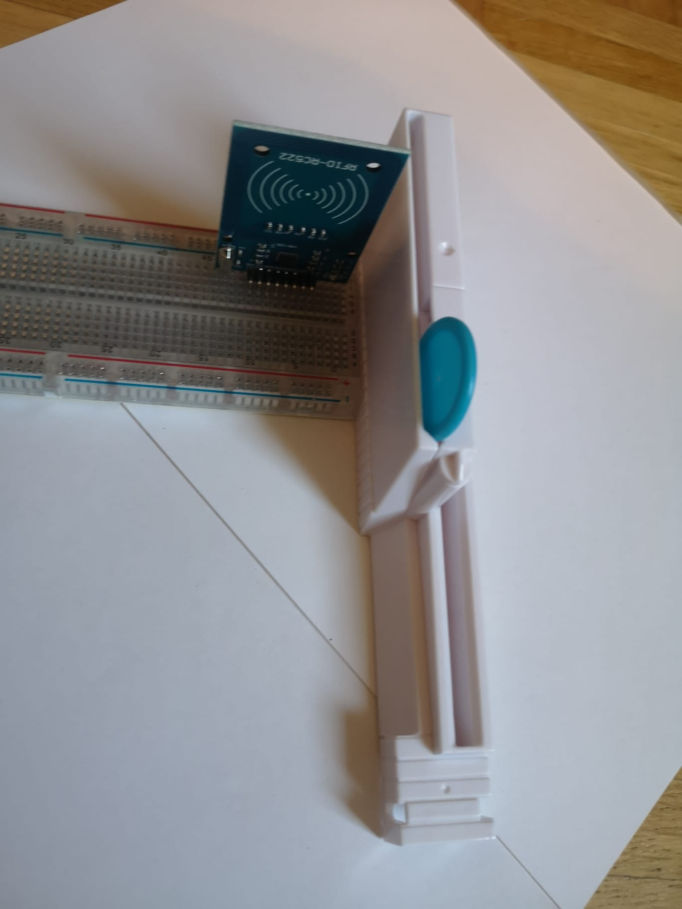
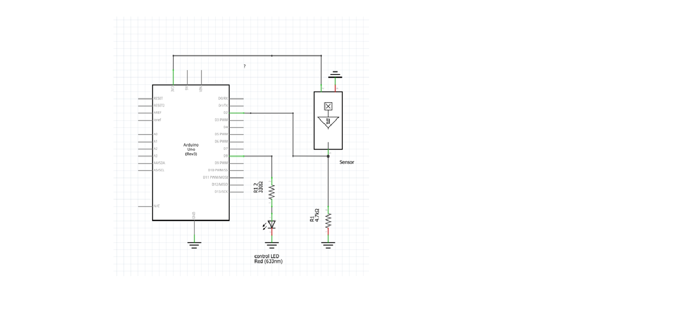
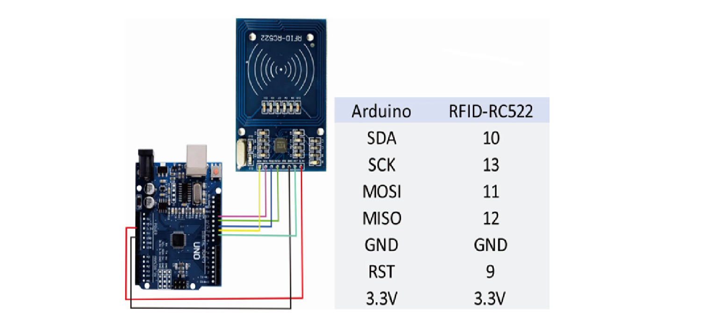

# **Points system**

## **Concept**

Touching the aircraft with the chip must be recognized by the sensor. As the aircraft can move in both directions, the sensor must be positioned as shown in the image below. The chip holder can be removed and replaced with a small size 3D printed sensor holder.


Both possible positions of the sensors are marked with red crosses.


Positions of the Hall sensor



Positions of the inductive sensor





Positions of the RFID-RC522


## Reed switch modul

## Inductive sensor LJ12A3-4-Z/BX DC6-36V

## Hallsensor Modul

**Advantage**

small size, the metal part can be concealed underneath the aircraft, easier to replace and easier to program

**Disadvantage**

It is difficult to find a position in which a touch is unambiguously defined. At any change of position the touch is not detected or there is a rapid and frequent change between high and low signal. This leads to a misinterpretation.

### **Circuit**



### **Code for the test with Arduino**

```c
#define PIN_LED_GREEN   9
#define PIN_LED_RED     8
#define PIN_REED_SWITCH 2

void setup()
{
    pinMode(PIN_LED_GREEN,   OUTPUT);
    pinMode(PIN_LED_RED,     OUTPUT);
    pinMode(PIN_REED_SWITCH, INPUT);
}

void loop()
{
    if (digitalRead(PIN_REED_SWITCH) == HIGH) {
        digitalWrite(PIN_LED_RED, LOW);
        digitalWrite(PIN_LED_GREEN, HIGH);
    } else {
        digitalWrite(PIN_LED_RED, HIGH);
        digitalWrite(PIN_LED_GREEN, LOW);
    }
    delay(10);
}
```

## RFID RC522
**Advantage**

Greater freedom to change the design and rules of the game, as the sensitivity of the sensor depends on the distance to the chip and can be changed without problem by moving the holder. The signal is detected at distances of up to 4-5 cm. The 3D model for the holder is easy and can be made very fast.


**Disadvantage**

Large in size, the chip must be attached to the wing of the aircraft and will be very visible, complex to program (SPI)

### **Circuit** 



### **Code for the test with Arduino** 
```
#include <SPI.h>
#include <RFID.h>
#define SS_PIN 10
#define RST_PIN 9
RFID rfid(SS_PIN, RST_PIN);
String rfidCard;
void setup() {
  Serial.begin(9600);
  Serial.println("Starting the RFID Reader...");
  SPI.begin();
  rfid.init();
}
void loop() {
  if (rfid.isCard()) {
    if (rfid.readCardSerial()) {
      rfidCard = String(rfid.serNum[0]) + " " + String(rfid.serNum[1]) + " " + String(rfid.serNum[2]) + " " + String(rfid.serNum[3]);
      Serial.println(rfidCard);
    }
    rfid.halt();
  }
}
```